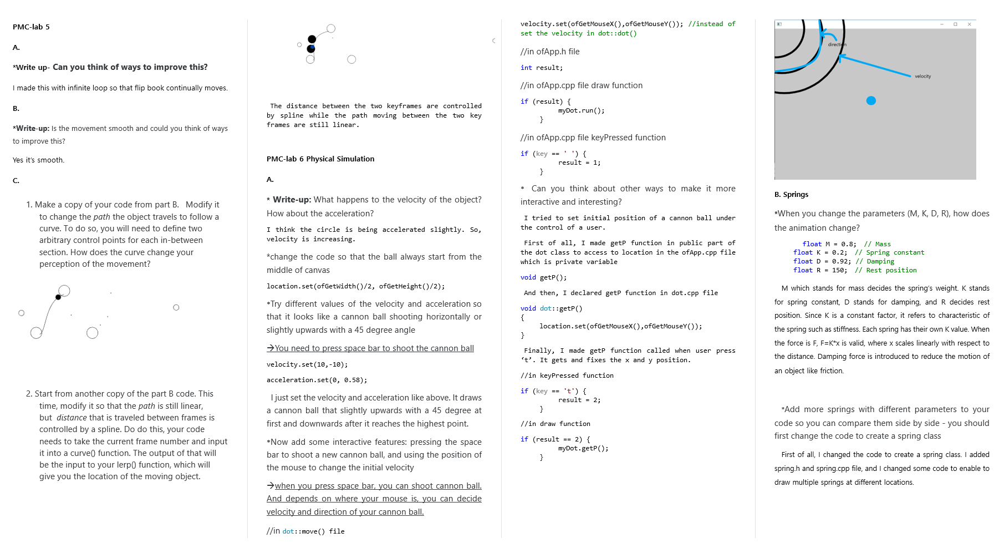
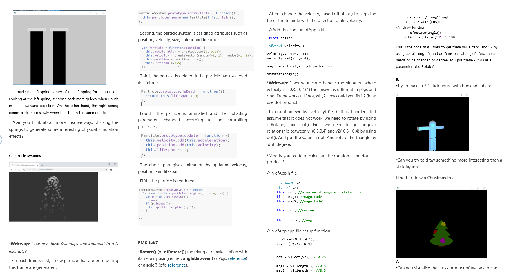
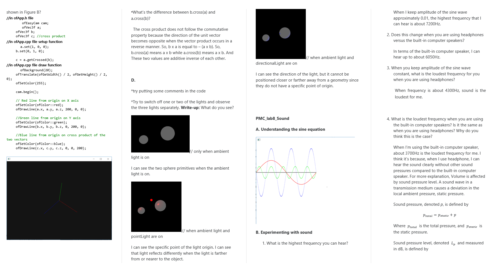
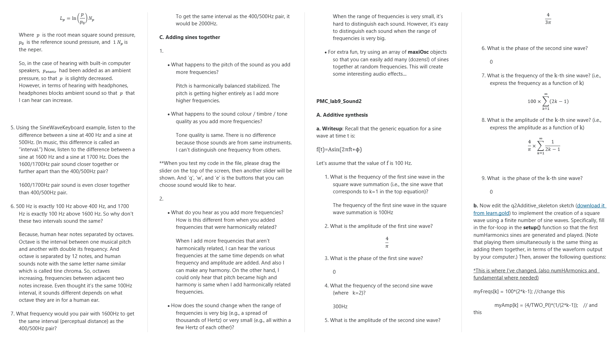
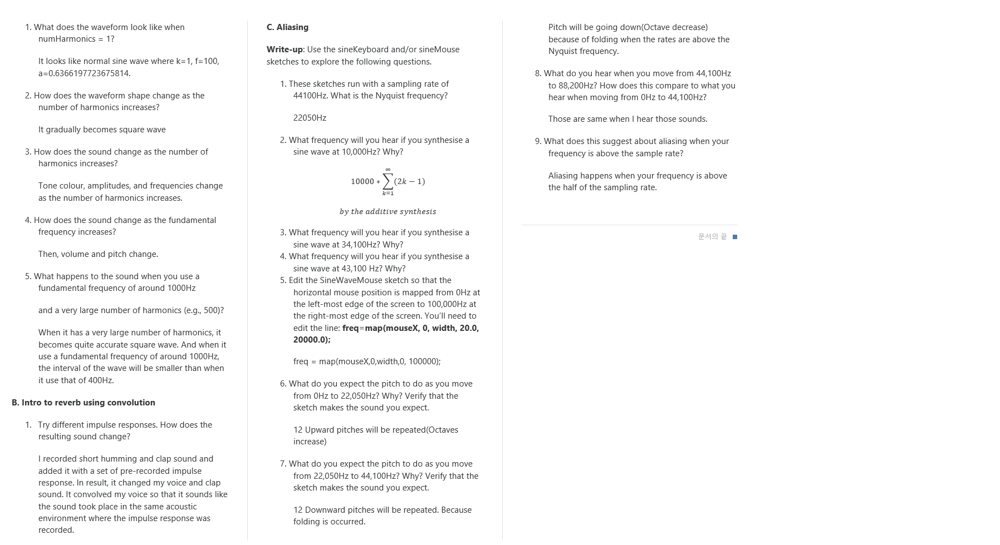

# Perception and Multimedia Lecture Sumup

This is what i've done in the lecture and lab assignment.

For final mini project, I made an keyboard piano. 
If you want further explanation about this, the report regard to the mini project is in the 'Mini project' directory.
